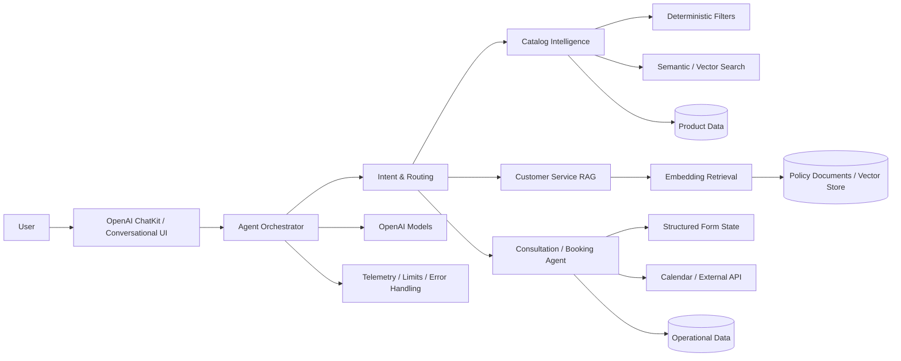
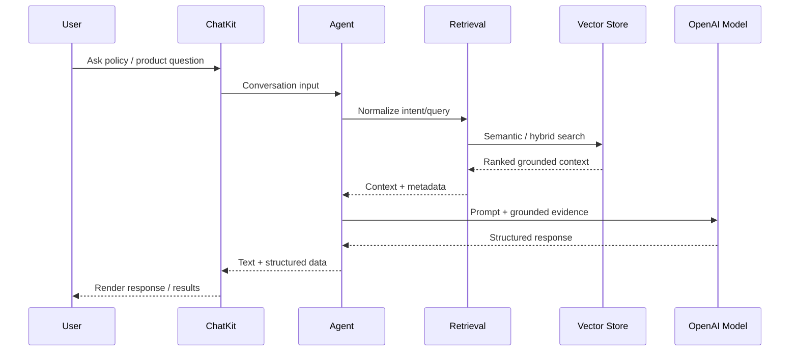

# Case Study — Agentic Commerce & Catalog Intelligence

## Context

A commerce assistant needed to move beyond generic conversational responses and become grounded in real product and service data. The problem required more than connecting an LLM to a chat UI: it needed a conversational surface, intent recognition, deterministic retrieval, semantic search, tool execution, session context, structured outputs, operational limits and integrations with business services.

The underlying implementation was developed through private repositories. This case study deliberately describes the architecture and engineering decisions without publishing proprietary source code.

## Architecture

## Conversational experience

**OpenAI ChatKit** was used as part of the conversational application layer, with agent responses adapted for both human-readable text and structured product/widget data.

That separation matters because the UI contract is different from the model contract: the model may reason over tools and retrieved context, while the conversational layer needs stable response shapes, streaming behavior and structured data that can be rendered reliably.

## Key engineering decisions

### 1. Agentic where useful; deterministic where better

Not every request benefits from an agent loop.

For high-frequency catalog discovery, the architecture introduced a deterministic execution path for predictable intent → retrieval → response behavior. Agentic execution remains available for multi-step or ambiguous interactions.

This creates a deliberate trade-off between:

- flexibility;
- latency;
- token consumption;
- cost;
- observability; and
- failure modes.

The implementation included explicit iteration and execution-time limits so an agent could not loop indefinitely.

### 2. Ground responses in real data

Product discovery combines structured filtering with semantic retrieval. Customer-service answers use retrieval over embedded policy content rather than relying on model memory alone.

The objective is simple:

> **The model reasons; enterprise systems remain authoritative for facts.**

### 3. Structured contracts around the model

LLM responses are not allowed to become an untyped integration surface.

The solution uses typed/validated contracts for:

- user intent;
- product results;
- agent responses;
- consultation data;
- tool inputs;
- state transitions; and
- error/fallback behavior.

Python implementations use Pydantic-style validation; TypeScript implementations use typed runtime contracts.

### 4. External actions remain explicit tools

Operational actions such as appointment creation or persisted support requests are separated from free-form generation.

That means the architecture can reason explicitly about:

- authentication;
- authorization;
- retries;
- idempotency;
- partial failure; and
- observability.

### 5. Configuration is separated from code

Prompts, instructions, intent synonyms and tool playbooks are externalized so behavior can evolve without embedding every policy decision directly in application logic.

## RAG flow

## Technologies used

Representative technologies across the implementation:

- **OpenAI ChatKit**
- OpenAI models, Agents tooling and embeddings
- Python and TypeScript
- LangChain / agent orchestration
- **Supabase / PostgreSQL / vector search**
- Pydantic / typed response contracts
- Next.js / React
- Microsoft Graph API for calendar integration
- REST/tool interfaces
- automated tests and smoke checks

## What I owned

My role was not simply to ask a coding model to generate an application.

I owned the engineering direction across:

- problem decomposition;
- architecture and component boundaries;
- build-vs-agentic decisions;
- retrieval strategy;
- tool/interface design;
- data contracts;
- implementation experiments and prototypes;
- integration choices;
- review and debugging;
- test and acceptance criteria; and
- the transition from a proof of concept toward a reusable agent platform.

AI coding tools were used heavily during implementation. I consider that part of modern engineering practice. Technical ownership remained with me.

## What I would change at enterprise scale

A larger enterprise deployment would add or strengthen:

- central model gateway and provider abstraction;
- enterprise identity and workload identity;
- secrets management and key rotation;
- formal model/evaluation registry;
- prompt and tool versioning;
- policy enforcement around tool execution;
- distributed tracing across agent/tool/model calls;
- cost and token budgets by use case;
- red-team and safety evaluations;
- resilient queues for long-running actions;
- stronger human-in-the-loop controls for consequential actions; and
- formal SLOs for quality, latency and availability.

## What this case study proves

The relevant skill is not memorizing framework APIs.

It is understanding how the conversational experience, LLMs, retrieval, state, tools, enterprise data, APIs, validation and operational controls fit together — and being able to move between an architecture diagram and the behavior of the individual components.
