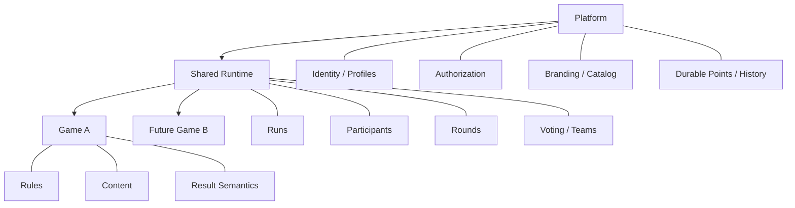

# Case Study — Group Games Platform

## Context

A single party game evolved into a reusable mobile-first game platform. The key architectural challenge was preventing the first game's implementation from becoming the architecture for every future game.

The solution therefore separates **Platform**, **Shared Runtime**, and **Game-specific** ownership.

## Three-layer architecture



## Core design principle

> **Runtime owns mechanics; games own semantics and policy.**

This avoids a premature universal `GameEngine` while still enabling capabilities to be promoted into shared runtime when there is a real second consumer.

## Identity is not authorization

One of the strongest architectural decisions was to keep these concepts separate:

```text
Authentication
    ≠
Durable person identity
    ≠
Game participation
    ≠
Host capability
    ≠
Administrator capability
```

A valid authentication session does not automatically confer privileged capability.

Server-side services and database policies remain authoritative. UI visibility is treated as usability, not security.

## Backend boundaries

The backend separates:

- Next.js request handling;
- platform services;
- shared-runtime services;
- game services;
- Supabase access;
- RLS/RPC authorization; and
- privileged server-only operations.

Privileged credentials are never exposed through browser-safe variables.

## Database engineering

The system uses migration-driven evolution with explicit verification:

```text
Architecture / specification
        ↓
Additive migration
        ↓
Generated types
        ↓
RLS + integrity tests
        ↓
Disposable database verification
        ↓
Application checks
        ↓
Explicit hosted deployment
```

The hosted database is not used as a scratch environment for destructive development.

## Evolutionary architecture

The platform intentionally avoids large “clean architecture” rewrites for their own sake.

Key rules include:

- preserve accepted behavior first;
- use additive compatibility while extracting shared capabilities;
- promote a mechanic only when there is evidence it is genuinely reusable;
- keep run-scoped state run-scoped;
- keep authorization independent from game state;
- use regression gates between risky extraction slices; and
- maintain architecture-decision records for durable choices.

## Technologies used

- Next.js / React / TypeScript
- Supabase Auth / PostgreSQL / Storage
- PostgreSQL RLS and RPCs
- Storybook / component-driven UI
- GitHub Actions
- Vercel
- schema migrations and generated types
- E2E/unit/component/database verification

## What I owned

- platform decomposition;
- identity and authorization model;
- shared-runtime boundaries;
- database ownership principles;
- migration and verification strategy;
- architecture documentation;
- CI/deployment approach;
- acceptance criteria for implementation work; and
- iterative review of AI-assisted code changes.

## What this case study proves

This work demonstrates architecture at implementation depth: not only defining boxes, but specifying which layer owns state, where trust boundaries sit, how schemas evolve, how authorization is enforced, and how architecture can change without destabilizing a working product.
