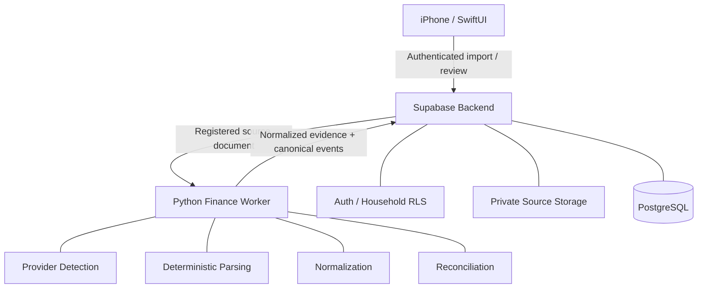
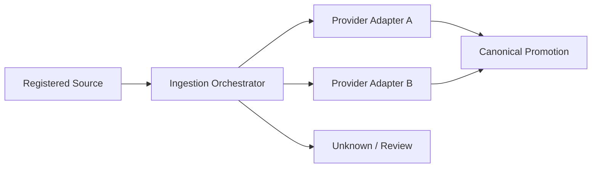

# Case Study — Personal Finance Data Platform

## Context

A household finance platform needs to ingest financial documents from multiple providers while preserving exact evidence and avoiding “AI guessed my money” failure modes.

The architecture deliberately separates deterministic financial facts from optional intelligence.

## Architecture



## Design rule: evidence before interpretation

The source-to-canonical flow is explicit:

```text
Source file
   ↓
SourceDocument
   ↓
ImportBatch
   ↓
SourceRecord(s)
   ↓
Duplicate / conflict / reconciliation
   ↓
Canonical financial event
   ↓
Derived financial views
```

The original source remains evidence. Classification is an interpretation of that evidence and can evolve independently.

## Deterministic money handling

Authoritative financial values are handled using deterministic parsing and exact decimal arithmetic.

LLMs are intentionally **not authoritative** for:

- monetary amounts;
- dates;
- account identity;
- transaction existence; or
- reconciliation.

AI can later assist with interpretation/classification, but it sits downstream of deterministic extraction.

## Idempotency and duplicate safety

The same document can safely be selected more than once.

The system uses source hashes, semantic identity and canonical lineage to distinguish:

- exact duplicate evidence;
- semantically duplicate events;
- conflicting evidence; and
- genuinely new activity.

Conflicting sources cannot silently overwrite accepted canonical data.

## Security model

- household-scoped RLS;
- private source-document storage;
- immutable evidence fields;
- server-owned source identity;
- no production financial documents in the code repository;
- sensitive-file checks in CI; and
- device-level session/lock boundaries in the iOS architecture.

## Multi-provider architecture

Provider-specific parsing is hidden behind a provider-neutral ingestion orchestrator.



This preserves the already-accepted provider path while enabling additional providers through additive implementation.

## Technologies used

- SwiftUI / iOS
- Python
- Supabase / PostgreSQL / RLS
- private object storage
- deterministic PDF/CSV parsing
- Decimal arithmetic
- Ruff / mypy / pytest
- pgTAP / database integrity tests
- GitHub Actions

## What I owned

- architecture and source-of-truth semantics;
- source lineage model;
- parser/orchestrator boundaries;
- duplicate/conflict rules;
- deterministic-vs-AI decision;
- privacy constraints;
- verification strategy;
- read-model semantics; and
- phased implementation roadmap.

## What this case study proves

This is less about building a dashboard and more about data architecture discipline: defining what is authoritative, preserving evidence, handling ambiguity explicitly, making ingestion replay-safe, and ensuring intelligence cannot corrupt financial truth.
