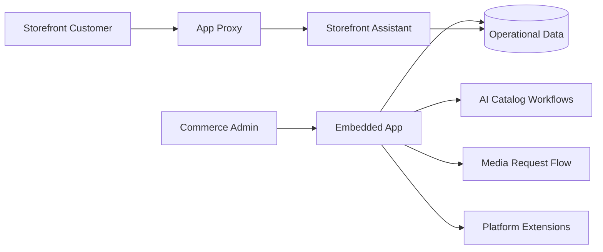

# Case Study — AI-Assisted Store Operations

## Context

An embedded commerce operations application combines AI-assisted catalog work with storefront and administrator experiences.

The engineering challenge is not only generating content. The system must operate correctly across platform authentication, embedded admin UX, storefront proxy routes, extensions, hosted environments and deployment configuration.

## Capability view



## Key engineering decisions

### Separate admin and storefront trust boundaries

The administrator application and storefront-facing endpoints have different authentication and exposure models.

Public/storefront routes use explicit proxy boundaries rather than reusing privileged administrator behavior.

### Treat deployment configuration as code

Configuration drift is a real operational risk for embedded applications.

The repository therefore includes pre-deployment checks that block deployment when platform configuration still points to:

- temporary tunnel URLs;
- placeholder domains; or
- inconsistent API/proxy assumptions.

### Keep runtime-specific validation separate

Not every component executes in the same runtime.

For example, server/application checks and edge-function checks are separated because Node and edge/Deno execution have different contracts.

## Verification model

```text
lint
  + typecheck
  + tests
  + configuration drift checks
  + schema validation
  + production build
        ↓
pre-deployment environment validation
        ↓
hosted authentication / proxy smoke checks
```

## Technologies used

- Shopify embedded applications
- React / TypeScript
- API / app-proxy routes
- platform extensions
- Supabase-backed operational flows
- hosted deployment environments
- automated config/deploy guards

## What I owned

- capability architecture;
- route and trust-boundary design;
- integration workflow;
- development vs. hosted-environment model;
- deployment verification;
- operational documentation; and
- review of AI-assisted implementation.

## What this case study proves

“Hands-on” architecture includes the operational edges: authentication, platform constraints, environment drift, proxy behavior, deployment safety and runtime-specific verification — not only the central application code.
