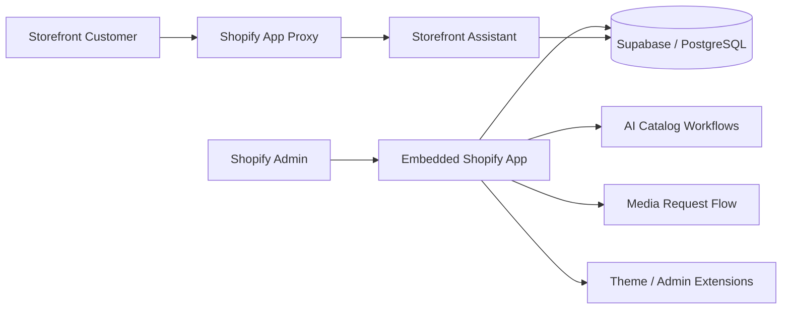

# Case Study — AI-Assisted Store Operations

## Context

An embedded commerce operations application combines AI-assisted catalog work with storefront and administrator experiences.

The engineering challenge is not only generating content. The system must operate correctly across Shopify authentication, embedded admin UX, storefront proxy routes, extensions, Supabase-backed operational data, hosted environments and deployment configuration.

## Capability view



## Shopify application model

The implementation uses multiple Shopify application surfaces rather than treating Shopify as a simple storefront API:

- embedded Shopify application;
- Admin GraphQL queries and mutations;
- App Proxy endpoints for storefront-facing behavior;
- Theme App Extension / app embed for the storefront assistant; and
- administrator extensions for catalog actions.

This creates explicit separation between merchant/admin capabilities and customer-facing storefront interactions.

## Key engineering decisions

### Separate admin and storefront trust boundaries

The administrator application and storefront-facing endpoints have different authentication and exposure models.

Public/storefront routes use explicit App Proxy boundaries rather than reusing privileged administrator behavior.

### Supabase as the operational data layer

Supabase is used for operational persistence and service-side workflows, including PostgreSQL-backed records and Edge Function-style processing where appropriate.

This provides a clear separation between Shopify as the commerce platform and the application-owned operational state.

### Treat deployment configuration as code

Configuration drift is a real operational risk for embedded applications.

The repository therefore includes pre-deployment checks that block deployment when platform configuration still points to:

- temporary tunnel URLs;
- placeholder domains; or
- inconsistent API/proxy assumptions.

### Keep runtime-specific validation separate

Not every component executes in the same runtime.

For example, server/application checks and edge-function checks are separated because Node and edge/Deno execution have different contracts.

## Verification model

```text
lint
  + typecheck
  + tests
  + Shopify configuration drift checks
  + schema validation
  + production build
        ↓
pre-deployment environment validation
        ↓
hosted authentication / App Proxy smoke checks
```

## Technologies used

- **Shopify Apps**
- Shopify Admin GraphQL
- Shopify App Proxy
- Theme App Extensions / app embeds
- React / TypeScript
- **Supabase / PostgreSQL / Edge Functions**
- API routes and external AI services
- hosted deployment environments
- automated config/deploy guards

## What I owned

- capability architecture;
- route and trust-boundary design;
- Shopify integration workflow;
- Supabase application-data boundaries;
- development vs. hosted-environment model;
- deployment verification;
- operational documentation; and
- review of AI-assisted implementation.

## What this case study proves

“Hands-on” architecture includes the operational edges: platform authentication, API contracts, data ownership, environment drift, proxy behavior, deployment safety and runtime-specific verification — not only the central application code.
